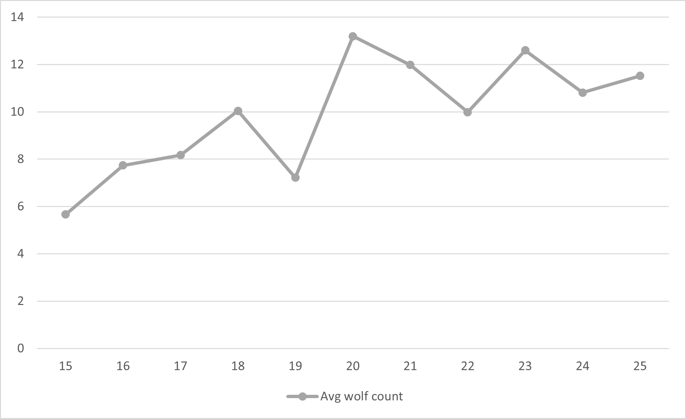

# Комп'ютерні системи імітаційного моделювання

СПм-22-5, Прудіус Микита Андрійович
 
Лабораторна робота №2. Редагування імітаційних моделей у середовищі NetLogo

Варіант 7, модель у середовищі NetLogo: [Wolf Sheep Predation](http://www.netlogoweb.org/launch#http://www.netlogoweb.org/assets/modelslib/Sample%20Models/Biology/Wolf%20Sheep%20Predation.nlogo)


## Внесені зміни у вихідну логіку моделі, за варіантом:
*Прибрати "зграйність" вовків - тепер перед початком свого ходу вовки повинні "оглядатися", перевіряючи оточення, та обирати напрямок руху виходячи з наявності вівець та відсутності інших вовків. Якщо немає іншої можливості – переміщається випадково. При знаходженні на одній ділянці поля двох вовків залишається лише один з них. Вівці переміщаються випадковим чином, але при виявленні вовка на одній із клітин поруч змінюють напрямок на протилежний.*

Для вирішення цього завдання було додано декілька глобальних змінних:

``` NetLogo
globals [
  vision-distance ; дальність зору
] 
```

Для більшої реалістичності моделі вовки будуть дещо швидшими за овець, це було зроблено під час встановлення глобальних змінних:

```Netlogo
to setup
    set wolf-speed 1.325
    set sheep-speed 1
    set vision-distance 7
end
```

Наступним кроком було змінено поведінку при переміщенні для вовків (це відбувається у процедурі to move):

``` NetLogo
to move
    
    ifelse is-wolf? self
    [   ;if i'm a wolf

        let is-sheep-found? false   ; чи було знайдено вівцю
        let is-wolf-found? false    ;                  вовка

        let found-sheep other sheep in-radius vision-distance   ; пошук овець у радіусі зору
        let found-wolves other wolves in-radius vision-distance ; пошук вовків у радіусі зору

        let closest-sheep min-one-of found-sheep [distance myself]  ; обрання найближчої вівці
        let closest-wolf min-one-of found-wolves [distance myself]  ; обрання найближчого вовка

        if closest-sheep != nobody
        [ set is-sheep-found? true ]

        if closest-wolf != nobody
        [ set is-wolf-found? true ]

        ifelse is-wolf-found? and is-sheep-found?   ; якщо було знайдено обох віддаємо перевагу вівці
        [
            face closest-sheep
            fd wolf-speed
        ]
        [
            ifelse is-wolf-found? ; якщо було знайдено тільки вовка - тікаємо
            [
                face closest-wolf
                rt 180
                fd wolf-speed
            ]
            [
                ifelse is-sheep-found? ; якщо було знайдено тільки вівцю - йдемо за нею
                [
                    face closest-sheep
                    fd wolf-speed
                ]
                [ wander ] ; якщо нікого - блукаємо
            ]
        ]
    ]
```

Якщо, вовк бачить тільки вівцю, то він прямує за нею. Якщо бачить тільки іншого вовка, то він тікає від нього. Якщо бачить обох - віддає перевагу вівці.

Далі йде реалізація втікання від вовка для вівці (продовження гілки умови у процедурі to move):

``` Netlogo
    [   ;if i'm a sheep
        let is-sheep-found? false
        let is-wolf-found? false

        let found-sheep other sheep in-radius vision-distance
        let found-wolves other wolves in-radius vision-distance

        let closest-sheep min-one-of found-sheep [distance myself]
        ifelse count found-sheep >= 3 ; частина функціоналу на власний розсуд
        [
        set closest-sheep one-of min-n-of 3 found-sheep [distance myself]
        ]
        [
        set closest-sheep one-of min-n-of (count found-sheep) found-sheep [distance myself]
        ]

        let closest-wolf min-one-of found-wolves [distance myself]

        if closest-sheep != nobody
        [ set is-sheep-found? true ]

        if closest-wolf != nobody
        [ set is-wolf-found? true ]

        ifelse is-wolf-found? ; якщо було знайдено вовка - тікаємо
        [
            face closest-wolf
            rt 180
            fd sheep-speed
        ]
        [
            ifelse is-sheep-found? ; частина функціоналу на власний розсуд
            [
                ifelse maximum-separation < distance closest-sheep ; and distance closest-sheep > minimum-separation
                [ 
                    face closest-sheep
                    fd sheep-speed
                ]
                [
                    ifelse model-version = "sheep-wolves-grass"
                    [
                        let grass-patches patches with [countdown = grass-regrowth-time] in-radius vision-distance
                        let closest-grass []
                        ifelse count grass-patches >= 3
                        [
                            set closest-grass one-of min-n-of 3 grass-patches [distance myself]
                        ]
                        [
                            set closest-grass one-of min-n-of (count grass-patches) grass-patches [distance myself]
                        ]

                        ifelse closest-grass != nobody
                        [
                            face closest-grass
                            fd sheep-speed
                        ]
                        [ wander ]
                    ]
                    [ wander ]
                ]
            ]
            [ wander ] 
        ]
    ]
end
```

Додавання можливості фатальної бійки між вовками (процедура to death):
``` NetLogo
to death  
    if is-wolf? self ; якщо це вовки
    [
        if count wolves-here >= 2
        [
            ask one-of wolves-here [ die ]  ; то хто з них помре
        ]
    ]
end
```

## Внесені зміни у вихідну логіку моделі, на власний розсуд:

На власний розсуд було додано можливість вівцям збиратися у зграї. Для цього було додано ще один глобальний параметр.

``` NetLogo
globals [
    maximum-separation ; максимальна відстань між вівцями у зграї
] 
```

``` NetLogo
    set maximum-separation 6 ; за замовуванням встановлюється рівни 6
```

Реалізація цієї можливості (та інших) наявна у коді з попереднього завдання, тому наводиться код, що відповідає безпосередньо за цю зміну:  

``` Netlogo
    [  
        ifelse count found-sheep >= 3 ; для того, щоб вівці не орієнтувалися тільки на одну вівцю
        [
            set closest-sheep one-of min-n-of 3 found-sheep [distance myself]
        ]
        [
            set closest-sheep one-of min-n-of (count found-sheep) found-sheep [distance myself]
        ]

        ifelse is-wolf-found? ; якщо було знайдено вовка - тікаємо
        [
            face closest-wolf
            rt 180
            fd sheep-speed
        ]
        [
            ifelse is-sheep-found? ; Якщо було знайдено вівцю, то йдемо за нею
            [
                ifelse maximum-separation < distance closest-sheep ; and distance closest-sheep > minimum-separation
                [ 
                    face closest-sheep
                    fd sheep-speed
                ]
                [   ; Якщо поруч є вівці, проте ми знаходимось досить близько до них, то шукаємо траву, якщо обрано відповідний режим
                    ifelse model-version = "sheep-wolves-grass"
                    [
                        let grass-patches patches with [countdown = grass-regrowth-time] in-radius vision-distance
                        let closest-grass []
                        ifelse count grass-patches >= 3
                        [
                            set closest-grass one-of min-n-of 3 grass-patches [distance myself]
                        ]
                        [
                            set closest-grass one-of min-n-of (count grass-patches) grass-patches [distance myself]
                        ]

                        ifelse closest-grass != nobody
                        [
                            face closest-grass
                            fd sheep-speed
                        ]
                        [ wander ]
                    ]
                    [ wander ]
                ]
            ]
            [ wander ] ; в усіх інших випадках блукаємо
        ]
    ]
end
```

Також було змінено функцію блукання (випадкового руху) для більшої зрчності:

```
to wander 
    rt random 50
    lt random 50

    ifelse is-wolf? self
    [  fd wolf-speed  ]
    [  fd sheep-speed ]
end
```

Також було помічено, що вовки часто їдять один одного (через те, що віддають перевагу здобичі), або ж вмирають від голоду (якщо зробити перевагу втіканню від інших вовків), тому було трохи модифіковано функцію бійки, а саме додано вірогідність, що воне не будуть цього робити: 

``` NetLogo
to death  
    if is-wolf? self
    [
        if count wolves-here >= 2
        [
            if random-float 100 < 25 [ ask one-of wolves-here [ die ] ] ; Є 25%, що буде фатальна бійка
        ]
    ]

    if energy < 0 [ die ]
end
```


## Обчислювальний експеримент 

### Експеримент: Залежність кількості вовків від кількості енергії, що отримує вовк від їжі

Початкові умови:

- ***model-version*** = shee-wolves-grass
- ***initial-number-sheep*** = 100
- ***initial-number-wolves*** = 25
- ***grass-regrowth-time*** = 30
- ***sheep-gain-from-food*** = 4
- ***sheep-reproduce*** = 4
- ***wolf-reproduce*** = 6

Результати:



Висновки: при порівнянні з результатами попередньої лабораторної роботи видно, що вовкам стало значно важче виживати, бо вівці почали втікати від них, тому середня кількість вовків значно зменшилася.


